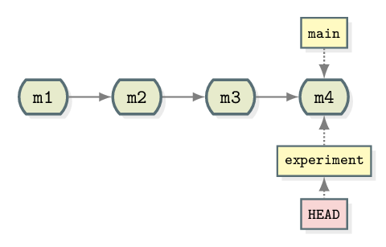
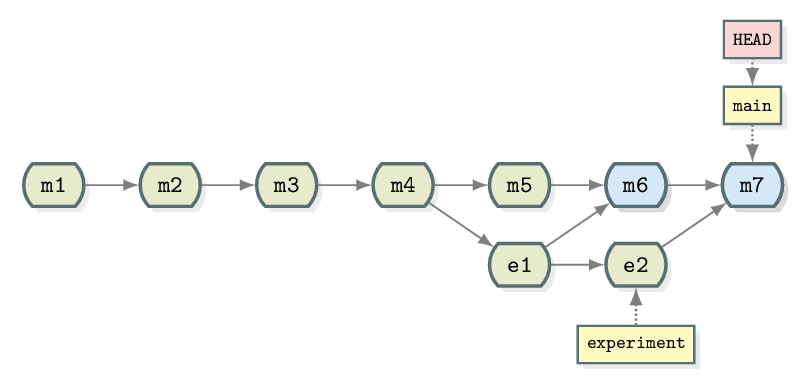

::::::::::::::::::::::::::::::::::::::: objectives

- Explain what git branches are and when they should be used
- Use a branch to develop a new feature
- Identify the branches in a project and which branch is currently in use
- Explain what merging is
- How to incorporate a feature from a branch into your code
- Describe a scalable workflow for development with git

::::::::::::::::::::::::::::::::::::::::::::::::::

:::::::::::::::::::::::::::::::::::::::: questions

- How can I or my team work on multiple features in parallel?
- How can changes from parallel tracks of work be combined?

::::::::::::::::::::::::::::::::::::::::::::::::::

## Motivation for branches

::::::::::::::::::::::::::::::::::::::  discussion

## Differing Goals and Objectives

Developer 1 -- "I need a new type of analysis to finish my thesis"

Developer 2 -- "My problem is bigger. I need better performance to process all my
data"

::::::::::::::::::::::::::::::::::::::::::::::::::

For simple projects, working with a single branch where you keep adding commits is good
enough. But chances are that you will want to unleash all the power of `git` at some
point and start using branches.

In a linear history, we have something like:

{alt='Linear'}

- Commits are depicted here as little boxes with abbreviated hashes.
- Here the branch `main` points to a commit.
- "HEAD" is the current position (remember the recording head of tape
  recorders?).
- When we talk about branches, we often mean all parent commits, not only the
  commit pointed to.

### Now we want to do this

{alt='Example of git merge'}

Software development is often not linear:

- We typically need at least one version of the code to "work" (to compile, to
  give expected results, ...).
- At the same time we work on new features -- possibly several features concurrently.
  Often they are unfinished.
- We need to be able to easily separate out work on different features.

The strength of version control is that it permits the researcher to **isolate
different tracks of work**, which can later be merged to create a composite
version that contains all changes:

{alt='Git collaborative'}

- We see branching points and merging points.
- Mainline development is usually carried out in a branch called `main`.
- Other than this convention there is nothing special about `main`, it is just
  a branch.
- Commits form a directed acyclic graph (arrows point from parent commits to
  child commits).
- Commits are **relative** to the preceding (parent) commit. Whilst
  Git can be described as taking "snapshots" of your project this is
  slightly misleading. Git actually records *the changes made since the last
  commit*. The difference is subtle but powerful, it makes commands like `git revert` possible.

A group of commits that create a single narrative are called a **branch**.
There are different branching strategies, but it is useful to think that a
branch tells the story of a feature, e.g. "fast sequence extraction" or "Python
interface" or "fixing bug in matrix inversion algorithm".

:::::::::::::::::::::::::::::::::::::::::  callout

## Starting point

Navigate to your `recipe` directory, containing the guacamole recipe
repository.

If you then type `git log --oneline`, you should see something like:

```output
ddef60e (HEAD -> main, origin/main) Revert "Added instruction to enjoy"
8bfd0ff Added 1/2 onion to ingredients
2bf7ece Added instruction to enjoy
ae3255a Adding ingredients and instructions
```

::::::::::::::::::::::::::::::::::::::::::::::::::

### Which Branch Are We Using?

To see where we are (where HEAD points to) use `git branch`:

```bash
git branch
```

```output
* main
```

- This command shows where we are, it does not create a branch.
- There is only `main` and we are on `main` (star represents the `HEAD`).

In the following we will learn how to create branches, how to switch between
them and how to merge changes from different branches.

***

:::::::::::::::::::::::::::::::::::::::::  callout

## A useful alias

We will now define an [*alias* in Git](https://git-scm.com/book/en/v2/Git-Basics-Git-Aliases),
to be able to nicely visualise branch structure in the terminal without having to
remember a long Git command:

```bash
git config --global alias.graph "log --all --graph --decorate --oneline"
```

We can now abbreviate `log --all --graph --decorate --oneline` with the alias `graph`.

::::::::::::::::::::::::::::::::::::::::::::::::::

## Creating and Working with Branches

Firstly let's take stock of the current state of our repository:

```bash
git graph
```

```output
* ddef60e (HEAD -> main, origin/main) Revert "Added instruction to enjoy"
* 8bfd0ff Added 1/2 onion to ingredients
* 2bf7ece Added instruction to enjoy
* ae3255a Adding ingredients and instructions
```

We have four commits and you can see that we are working on the main branch
from `HEAD -> main` next to the most recent commit. This can be represented
diagrammatically:

{alt='Git collaborative'}

Let's create a branch called `experiment` where we try out adding some
coriander to `ingredients.md`.

```bash
git branch experiment
git graph
```

```output
* ddef60e (HEAD -> main, origin/main, experiment) Revert "Added instruction to enjoy"
* 8bfd0ff Added 1/2 onion to ingredients
* 2bf7ece Added instruction to enjoy
* ae3255a Adding ingredients and instructions
```

Notice that the name of our new branch has appeared next to latest commit. HEAD
is still pointing to main however denoting that we have created a new branch but
we're not using it yet. This looks like:

{alt='Git collaborative'}

To start using the new branch we need to check it out:

```bash
git switch experiment
git graph
```

```output
* ddef60e (HEAD -> experiment, origin/main, main) Revert "Added instruction to enjoy"
* 8bfd0ff Added 1/2 onion to ingredients
* 2bf7ece Added instruction to enjoy
* ae3255a Adding ingredients and instructions
```

Now we see `HEAD -> experiment` next to the top commit indicating that we are
now working with, and any commits we make will be part of the `experiment`
branch. As shown before which branch is currently checked out can be confirmed
with `git branch`.

{alt='Git collaborative'}

Now when we make new commits they will be part of the `experiment` branch. To
test this let's add 1 tbsp coriander to `ingredients.md`. Stage this and commit
it with the message "try with some coriander".

```bash
git stage ingredients.md
git commit -m "try with some coriander"
git graph
```

```output
* 96fe069 (HEAD -> experiment) try with some coriander
* ddef60e (origin/main, main) Revert "Added instruction to enjoy"
* 8bfd0ff Added 1/2 onion to ingredients
* 2bf7ece Added instruction to enjoy
* ae3255a Adding ingredients and instructions
```

{alt='Git collaborative'}

Note that the main branch is unchanged whilst a new commit (labelled `e1`) has
been created as part of the experiment branch.

As mentioned previously, one of the advantages of using branches is working on
different features in parallel. You may have already spotted the typo in
`ingredients.md` but let's say that we've only just seen it in the midst of
our work on the `experiment` branch. We could correct the typo with a new commit
in `experiment` but it doesn't fit in very well here -- if we decide to discard
our experiment then we also lose the correction. Instead it makes much more
sense to create a correcting commit in `main`. First, switch to the main branch:

```bash
git switch main
```

Then fix the typing mistake in `ingredients.md`. And finally, commit that change (hint:
'avo' look at the first ingredient):

```bash
git stage ingredients.md
git commit -m "Corrected typo in ingredients.md"
git graph
```

```output
* d4ca89f (HEAD -> main) Corrected typo in ingredients.md
| * 96fe069 (experiment) try with some coriander
|/
* ddef60e (origin/main) Revert "Added instruction to enjoy"
* 8bfd0ff Added 1/2 onion to ingredients
* 2bf7ece Added instruction to enjoy
* ae3255a Adding ingredients and instructions
```

{alt='Git collaborative'}

## Merging

Now that we have our two separate tracks of work they need to be combined back
together. We should already have the `main` branch checked out (double check
with `git branch`). The below command can then be used to perform the merge.

```bash
git merge --no-edit experiment
```

```output
Auto-merging ingredients.md
Merge made by the 'ort' strategy.
 ingredients.md | 1 +
 1 file changed, 1 insertion(+)
```

now use:

```bash
git graph
```

```output
*   40070a5 (HEAD -> main) Merge branch 'experiment'
|\
| * 96fe069 (experiment) try with some coriander
* | d4ca89f Corrected typo in ingredients.md
|/
* ddef60e (origin/main) Revert "Added instruction to enjoy"
* 8bfd0ff Added 1/2 onion to ingredients
* 2bf7ece Added instruction to enjoy
* ae3255a Adding ingredients and instructions
```

{alt='Git collaborative'}

Merging creates a new commit in whichever branch is being **merged into** that
contains the combined changes from both branches. The commit has been
highlighted in a separate colour above but it is the same as every commit we've
seen so far except that it has two parent commits. Git is pretty clever at
combining the changes automatically, combining the two edits made to the same
file for instance. Note that the experiment branch is still present in the
repository.

:::::::::::::::::::::::::::::::::::::::  challenge

## Now you try

As the experiment branch is still present there is no reason further commits
can't be added to it. Create a new commit in the `experiment` branch adjusting
the amount of coriander in the recipe. Then merge `experiment` into `main`.

{alt='Git collaborative'}

:::::::::::::::  solution

## Solution

```bash
git switch experiment
# make changes to ingredients.md
git stage ingredients.md
git commit -m "Reduced the amount of coriander"
git switch main
git merge --no-edit experiment
git graph
```

```output
*   567307e (HEAD -> main) Merge branch 'experiment'
|\
| * 9a4b298 (experiment) Reduced the amount of coriander
* |   40070a5 Merge branch 'experiment'
|\ \
| |/
| * 96fe069 try with some coriander
* | d4ca89f Corrected typo in ingredients.md
|/
* ddef60e (origin/main) Revert "Added instruction to enjoy"
* 8bfd0ff Added 1/2 onion to ingredients
* 2bf7ece Added instruction to enjoy
* ae3255a Adding ingredients and instructions
```

:::::::::::::::::::::::::

::::::::::::::::::::::::::::::::::::::::::::::::::

## Summary

Let us pause for a moment and recap what we have learned:

```bash
git branch               # see where we are
git branch <name>        # create branch <name>
git switch <name>        # switch to branch <name>
```

Since the following command combo is so frequent:

```bash
git branch <name>        # create branch <name>
git switch <name>        # switch to branch <name>
```

There is a shortcut for it:

```bash
git switch -c <name>     # create branch <name> and switch to it
```

```bash
git merge <name>         # merge branch <name> (to current branch)
```

### Typical workflow

These commands can be used in a typical workflow that looks like the below:

```bash
$ git switch -c new-feature  # create branch, switch to it
$ git commit                 # work, work, work, ...
                             # test
                             # feature is ready
$ git switch main            # switch to main
$ git merge new-feature      # merge work to main
$ git branch -d new-feature  # remove branch
```

:::::::::::::::::::::::::::::::::::::::: keypoints

- Git allows non-linear commit histories called branches
- A branch can be thought of as a label that applies to a set of commits
- Branches can and should be used to carry out development of new features
- Branches in a project can be listed with `git branch` and created with `git branch branch_name`
- The `HEAD` refers to the current position of the project in its commit history
- The current branch can be changed using `git switch branch_name`
- Once a branch is complete the changes made can be integrated into the project using `git merge branch_name`
- Merging creates a new commit in the target branch incorporating all of the changes made in a branch

::::::::::::::::::::::::::::::::::::::::::::::::::
