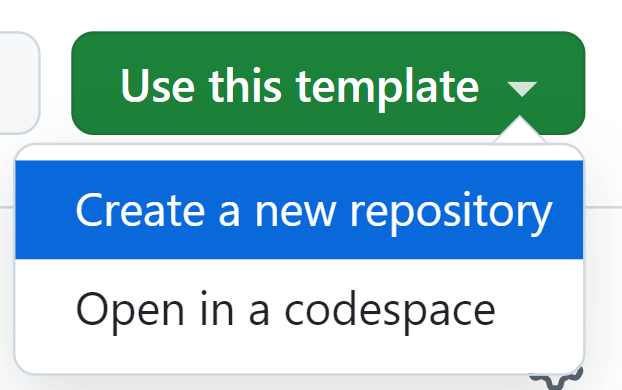

::::::::::::::::::::::::::::::::::::::: objectives

- Create a pull request from a branch within a repository.
- Create a pull request from a forked repository.
- Manage other people's contributions.
- Create releases at key points of the development.

::::::::::::::::::::::::::::::::::::::::::::::::::

:::::::::::::::::::::::::::::::::::::::: questions

- How do I put into practice all the previous knowledge at once?
- What caveats might I find in a real collaborative scenario?

::::::::::::::::::::::::::::::::::::::::::::::::::

## Collaborating in real life

This final episode is just a single exercise in which you will put into practice all the
knowledge acquired so far.

:::::::::::::::::::::::::::::::::::::::  challenge

## Making a book of recipes

Together with some colleagues, you are writing a book of recipes for sauces
and you are using Git for version control and GitHub to collaborate in the
writing of the book.

Form groups of 3-4 people and choose one to act as Administrator.

**Housekeeping** (Administrator's task):

- Create a new repository using the template [Book of Recipes repository](https://github.com/ImperialCollegeLondon/book_of_recipes) which has the skeleton of the book. (**Note**: Click on the green  "Use this template" button on the top right of the Book of Recipes repository and then select "Create a new repository")

  {alt='Use this template' class="img-responsive" style="float: left; margin-right: 10px; width: 20%;"}

- Set the owner of the new repository to your own GitHub username.

- Set the name of the repository to "book\_of\_recipes".

- Set the description to something like "Repository for the exercises of the Further Git Course".

- Make sure to select the "Public" option for your repository's visibility.

- Click on "Create repository".

- Pass the link for your repo to the other group members, who will be the contributors.

Now, start collaborating!

**Create a new release** (Administrator's task):

- Create a new release, let's say `1.0.0`, as the starting point of the book.

**Forking and cloning** (Contributor's task):

- Fork the Administrator's repository and clone it locally.

**Creating new issues** (to be done by everyone):

- Open new issues with recipes for sauces you would like to have in the book.

**Explore existing issues** (Contributor's task):

- Choose the issues you would like to work on. You will need to comment on them so that the administrator can assign them to you. (As you don't have write access to the repository, you cannot assign yourself to an issue directly.)

**Task assignment** (Administrator's task):

- Add some tags, prioritise some of the recipes, and assign yourself or one of your colleagues (after they have commented on it) as responsible for each of them.

**Working on a branch, pushing the changes, and opening a PR** (Contributor's tasks):

- Create a branch and work on the recipes you have been assigned. Practice the concepts learnt in previous episodes about making the changes locally and pushing those changes back to the remote repository.
- When ready, open a PR to the Administrator's repo and request their review.

**Reviewing and Merging PRs** (Administrator's tasks):

- Review the PR, request some changes and accept others. Make sure the relevant checks performed by the continuous integration system are all passing.
- When ready, merge the PR.

**Creating a new release** (Administrator's task):

- When all the recipes by the Contributors are added, create a new release.

::::::::::::::::::::::::::::::::::::::::::::::::::

## Bonus: Keeping your fork in sync with the original repo

In the previous exercise, the individual forks will be outdated as you
contribute content to the Administrator's repository (for example, if your or someone else's PR is merged on the Administrator's repository, you will see that the fork is out of sync). Follow these
instructions to make sure that your own forks are kept up to date.

- [Configuring a remote for a fork](https://help.github.com/en/github/collaborating-with-issues-and-pull-requests/configuring-a-remote-for-a-fork)
- [Syncing a fork](https://help.github.com/en/github/collaborating-with-issues-and-pull-requests/syncing-a-fork)

:::::::::::::::::::::::::::::::::::::::: keypoints

- Working collaboratively requires coordination -- use Issues to discuss with your colleagues who is doing what.
- Notifications from GitHub are very useful but also overwhelming when there are many contributions -- you will need to manage them.

::::::::::::::::::::::::::::::::::::::::::::::::::
